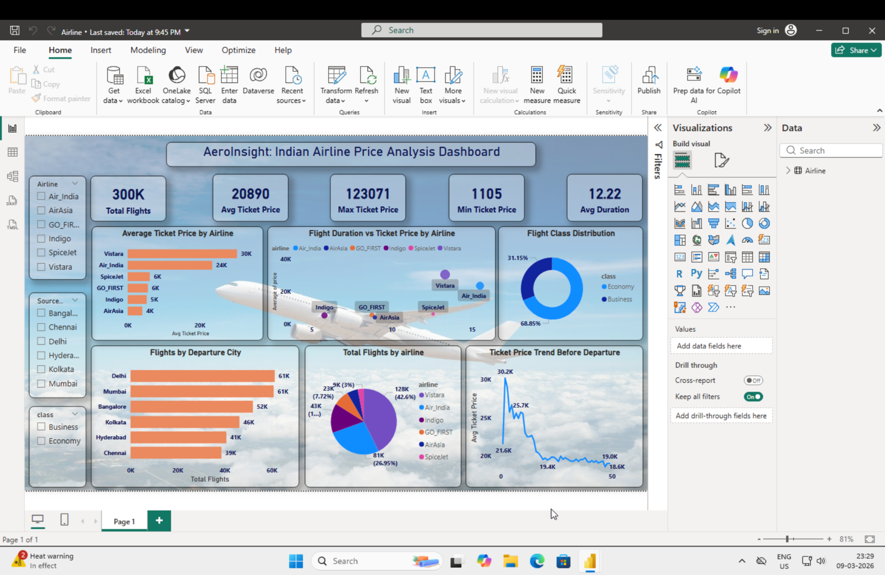

# ✈️ AerolInsight: Indian Airline Price Analysis Dashboard

This Power BI dashboard analyzes airline ticket pricing trends across major Indian airlines.  
The goal of this project is to understand pricing patterns, flight distribution, and ticket trends across different airlines and cities.

## 📊 Key Metrics
- Total Flights: 300K
- Average Ticket Price: 20,890
- Maximum Ticket Price: 123,071
- Minimum Ticket Price: 1,105
- Average Flight Duration: 12.22 hours

## 📈 Dashboard Insights

### Airline Analysis
- Vistara shows the highest average ticket price.
- Air India and Indigo handle a large share of total flights.

### Ticket Price Analysis
- Ticket prices vary significantly across airlines.
- Price trends decrease as departure date approaches.

### Flight Class Distribution
- Economy class dominates the majority of bookings.
- Business class accounts for a smaller percentage.

### City-wise Flight Distribution
- Delhi and Mumbai have the highest number of departing flights.

## 📊 Visualizations Used
- KPI Cards
- Bar Charts
- Scatter Plot (Flight Duration vs Ticket Price)
- Pie Chart
- Line Chart (Price Trend)
- City-wise Flight Distribution
- Interactive Filters

## 🛠 Tools Used
- Power BI
- Data Cleaning
- Data Modeling
- DAX
- Data Visualization

## 📷 Dashboard Preview

## 📂 Dataset Features
The dataset includes:
- Airline name
- Source and destination cities
- Flight duration
- Ticket price
- Flight class
- Flight date

## 🚀 Project Objective
The aim of this project is to demonstrate **data analysis and visualization skills using Power BI** while uncovering insights from airline ticket pricing data.
